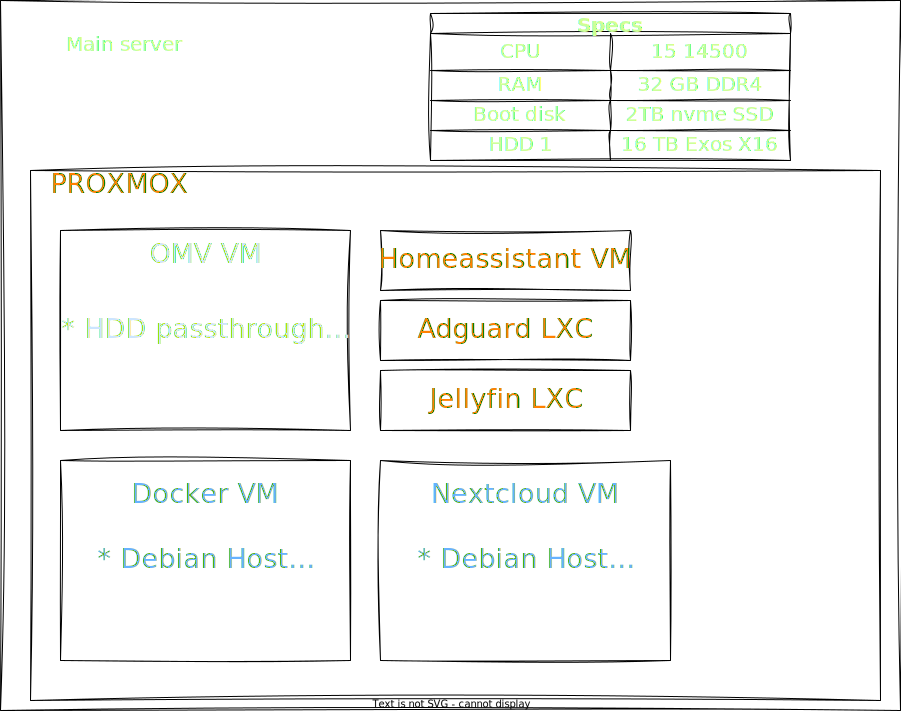

# Infra: 

This repository contains configuration files and playbooks that automate the setup and management of my servers, following the Infrastructure as Code (IaC) paradigm. The project leverages Ansible to provide a declarative approach for maintaining consistent and reproducible server environments.

## Homelab server infrastructure
Below is a basic overview of the VMs and containers that are running in my homelab.
